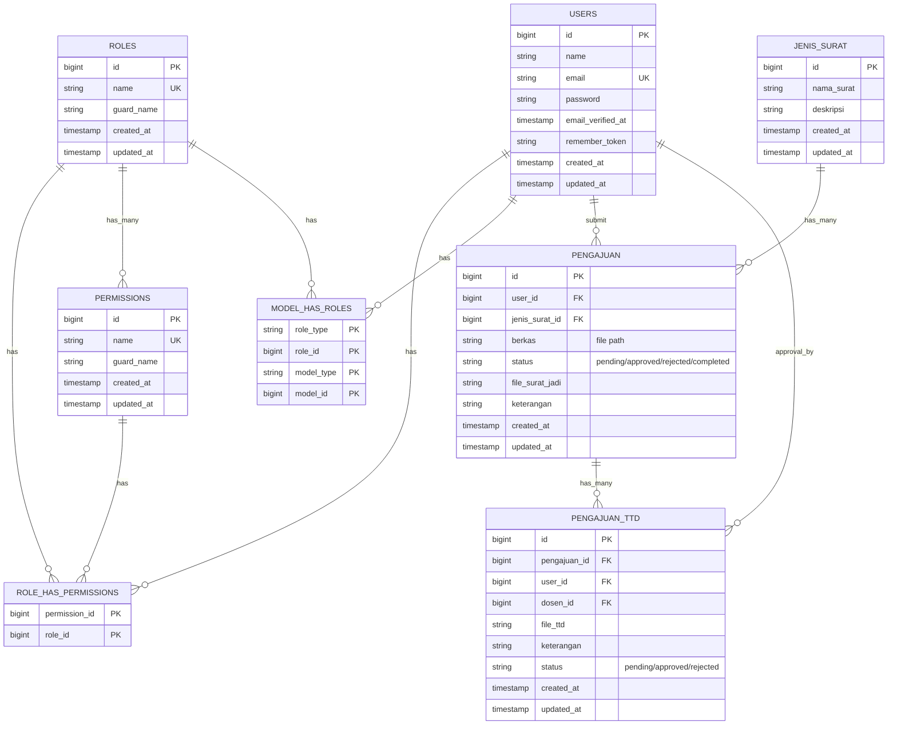
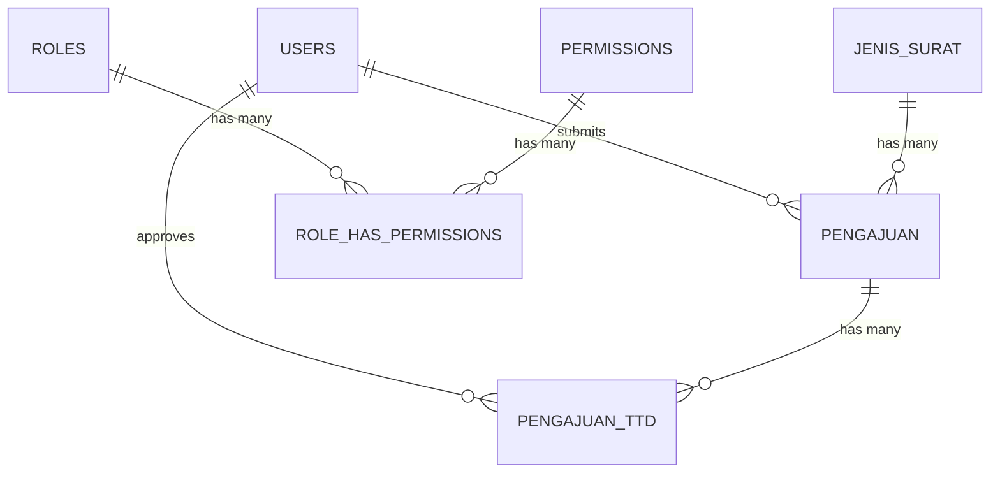

# Desain Relasi Tabel (ERD) - Sistem E-Surat

## 1. Mermaid ERD Diagram



---

## 2. Deskripsi Detail Relasi Tabel

### **Tabel: USERS**

```
PK: id (BIGINT)
Columns:
  - id: BIGINT, Primary Key, Auto Increment
  - name: VARCHAR(255), Not Null
  - email: VARCHAR(255), Unique, Not Null
  - password: VARCHAR(255), Not Null (Hashed)
  - email_verified_at: TIMESTAMP, Nullable
  - remember_token: VARCHAR(100), Nullable
  - created_at: TIMESTAMP
  - updated_at: TIMESTAMP

Relations:
  - Has Many → PENGAJUAN (user_id)
  - Has Many → PENGAJUAN_TTD (user_id sebagai pengguna)
  - Has Many → PENGAJUAN_TTD (dosen_id sebagai dosen)
  - Has Many → MODEL_HAS_ROLES (polymorphic)
```

### **Tabel: ROLES**

```
PK: id (BIGINT)
Columns:
  - id: BIGINT, Primary Key, Auto Increment
  - name: VARCHAR(125), Unique, Not Null
    Values: mahasiswa, dosen, admin, operator
  - guard_name: VARCHAR(125), Default: 'web'
  - created_at: TIMESTAMP
  - updated_at: TIMESTAMP

Relations:
  - Has Many → PERMISSIONS (Many-to-Many via ROLE_HAS_PERMISSIONS)
  - Has Many → MODEL_HAS_ROLES
```

### **Tabel: PERMISSIONS**

```
PK: id (BIGINT)
Columns:
  - id: BIGINT, Primary Key, Auto Increment
  - name: VARCHAR(125), Unique, Not Null
    Examples: create.pengajuan, read.pengajuan, update.pengajuan,
              delete.pengajuan, approve.pengajuan, reject.pengajuan, etc
  - guard_name: VARCHAR(125), Default: 'web'
  - created_at: TIMESTAMP
  - updated_at: TIMESTAMP

Relations:
  - Has Many → ROLE_HAS_PERMISSIONS
```

### **Tabel: ROLE_HAS_PERMISSIONS** (Bridge Table)

```
PK: (permission_id, role_id) - Composite Key
FK: permission_id → PERMISSIONS.id
FK: role_id → ROLES.id

Columns:
  - permission_id: BIGINT, Foreign Key (Cascade Delete)
  - role_id: BIGINT, Foreign Key (Cascade Delete)

Example Data:
  | permission_id | role_id |
  |---|---|
  | 1 (create.pengajuan) | 1 (mahasiswa) |
  | 2 (read.pengajuan) | 1 (mahasiswa) |
  | 3 (approve.pengajuan) | 2 (dosen) |
  | 4 (create.user) | 3 (admin) |
```

### **Tabel: MODEL_HAS_ROLES** (Polymorphic)

```
PK: (role_id, model_id, model_type) - Composite Key
FK: role_id → ROLES.id

Columns:
  - role_type: VARCHAR(125), Default: NULL
  - role_id: BIGINT, Foreign Key
  - model_type: VARCHAR(125), Usually 'App\Models\User'
  - model_id: BIGINT, Foreign Key ke USERS.id

Relations:
  - Belongs To ROLES
  - Belongs To USERS (polymorphic)

Kegunaan:
  Menghubungkan users dengan roles
  Satu user bisa punya multiple roles (jika diperlukan di masa depan)
```

### **Tabel: JENIS_SURAT**

```
PK: id (BIGINT)
Columns:
  - id: BIGINT, Primary Key, Auto Increment
  - nama_surat: VARCHAR(255), Not Null
  - deskripsi: TEXT, Nullable
    Examples: "Surat Keterangan Aktif Kuliah", "Surat Izin Cuti", dll
  - created_at: TIMESTAMP
  - updated_at: TIMESTAMP

Relations:
  - Has Many → PENGAJUAN (jenis_surat_id)
```

### **Tabel: PENGAJUAN** (Main Table)

```
PK: id (BIGINT)
FK: user_id → USERS.id (Cascade Delete)
FK: jenis_surat_id → JENIS_SURAT.id (Restrict Delete)

Columns:
  - id: BIGINT, Primary Key, Auto Increment
  - user_id: BIGINT, Not Null, Foreign Key
    (Mahasiswa yang mengajukan)
  - jenis_surat_id: BIGINT, Not Null, Foreign Key
  - berkas: VARCHAR(255), Nullable
    (Path ke file berkas: storage/pengajuan/...)
  - status: ENUM('pending', 'approved', 'rejected', 'completed')
    Default: 'pending'
  - file_surat_jadi: VARCHAR(255), Nullable
    (Path ke file surat final jadi)
  - keterangan: TEXT, Nullable
    (Catatan dari admin/operator)
  - created_at: TIMESTAMP
  - updated_at: TIMESTAMP

Relations:
  - Belongs To USERS (user_id)
  - Belongs To JENIS_SURAT (jenis_surat_id)
  - Has Many → PENGAJUAN_TTD (pengajuan_id)

Indexes:
  - user_id (untuk query cepat pengajuan per mahasiswa)
  - jenis_surat_id
  - status (untuk filter pengajuan berdasarkan status)
  - created_at (untuk sorting chronological)
```

### **Tabel: PENGAJUAN_TTD** (Signature Approval)

```
PK: id (BIGINT)
FK: pengajuan_id → PENGAJUAN.id (Cascade Delete)
FK: user_id → USERS.id (Cascade Delete)
FK: dosen_id → USERS.id (Cascade Delete)

Columns:
  - id: BIGINT, Primary Key, Auto Increment
  - pengajuan_id: BIGINT, Not Null, Foreign Key
    (Referensi ke pengajuan yang akan ditandatangani)
  - user_id: BIGINT, Not Null, Foreign Key
    (User yang melakukan approval - bisa dosen atau admin)
  - dosen_id: BIGINT, Nullable, Foreign Key
    (Dosen yang ditunjuk untuk menandatangani)
  - file_ttd: VARCHAR(255), Nullable
    (Path ke file tanda tangan digital)
  - keterangan: TEXT, Nullable
    (Catatan dari dosen saat approval/reject)
  - status: ENUM('pending', 'approved', 'rejected')
    Default: 'pending'
  - created_at: TIMESTAMP
  - updated_at: TIMESTAMP

Relations:
  - Belongs To PENGAJUAN (pengajuan_id)
  - Belongs To USERS (user_id - approver)
  - Belongs To USERS (dosen_id - signatory)

Indexes:
  - pengajuan_id
  - user_id
  - dosen_id
  - status
```

---

## 3. Relasi Antar Tabel - Detail

### **1:N Relations (One-to-Many)**

```
USERS → PENGAJUAN
  1 User (Mahasiswa) : N Pengajuan
  Keterangan: Satu mahasiswa bisa membuat multiple pengajuan surat
  Foreign Key: pengajuan.user_id → users.id
  Cascade: Delete (jika user dihapus, pengajuan juga dihapus)

JENIS_SURAT → PENGAJUAN
  1 Jenis Surat : N Pengajuan
  Keterangan: Satu jenis surat bisa di-request oleh multiple mahasiswa
  Foreign Key: pengajuan.jenis_surat_id → jenis_surat.id
  Cascade: Restrict (tidak bisa hapus jenis surat jika ada pengajuan)

PENGAJUAN → PENGAJUAN_TTD
  1 Pengajuan : N Pengajuan TTD
  Keterangan: 1 pengajuan bisa memiliki multiple approval steps
  Foreign Key: pengajuan_ttd.pengajuan_id → pengajuan.id
  Cascade: Delete (jika pengajuan dihapus, record TTD juga dihapus)

USERS → PENGAJUAN_TTD (as approver)
  1 User (Approver) : N Pengajuan TTD
  Foreign Key: pengajuan_ttd.user_id → users.id
  Cascade: Delete

USERS → PENGAJUAN_TTD (as signatory)
  1 User (Dosen) : N Pengajuan TTD
  Foreign Key: pengajuan_ttd.dosen_id → users.id
  Cascade: Set Null
```

### **M:N Relations (Many-to-Many)**

```
ROLES ← ROLE_HAS_PERMISSIONS → PERMISSIONS
  N Roles : N Permissions
  Bridge Table: role_has_permissions
  Keterangan: Banyak role bisa punya banyak permission

  Contoh:
  - Role "mahasiswa" punya permission: create.pengajuan, read.pengajuan
  - Role "dosen" punya permission: read.pengajuan, approve.pengajuan
  - Role "admin" punya permission: semua

USERS ← MODEL_HAS_ROLES → ROLES
  N Users : N Roles
  Polymorphic Relationship (Spatie Laravel Permission)
  Keterangan: User bisa memiliki multiple roles

  Contoh:
  - User1 punya role: mahasiswa
  - User2 punya role: dosen
  - User3 punya role: admin
```

---

## 4. Data Flow Diagram

```
┌─────────────────────────────────────────────────────────┐
│                   DATABASE STRUCTURE                     │
├─────────────────────────────────────────────────────────┤
│                                                           │
│  Authentication & Authorization Layer                   │
│  ┌──────────┐                                           │
│  │  USERS   │ ←─── Spatie Permission ──→ ┌──────────┐  │
│  └────┬─────┘                             │  ROLES   │  │
│       │                                   └────┬─────┘  │
│       │                                        │         │
│       │        Bridge: MODEL_HAS_ROLES        │         │
│       └─────────────────────────────────────────┘         │
│                                                           │
│  ┌────────────────┐                                      │
│  │ PERMISSIONS    │ ←── Bridge: ROLE_HAS_PERMISSIONS    │
│  └────────────────┘                                      │
│                                                           │
├─────────────────────────────────────────────────────────┤
│                                                           │
│  Business Logic Layer                                   │
│  ┌──────────┐        ┌──────────────┐                   │
│  │ PENGAJUAN├───────→│JENIS_SURAT   │                   │
│  └────┬─────┘        └──────────────┘                   │
│       │                                                  │
│       │         ┌──────────────────┐                    │
│       └────────→│PENGAJUAN_TTD     │                    │
│                 └──────────────────┘                    │
│                       ↓                                  │
│                 Linked to USERS                         │
│                 (user_id, dosen_id)                     │
│                                                           │
└─────────────────────────────────────────────────────────┘
```

---

## 5. Detailed Relationship Matrix

| From Table  | To Table             | Type           | FK Column      | Cascade  | Cardinality |
| ----------- | -------------------- | -------------- | -------------- | -------- | ----------- |
| USERS       | PENGAJUAN            | 1:N            | user_id        | Delete   | 1:Many      |
| USERS       | PENGAJUAN_TTD        | 1:N (approver) | user_id        | Delete   | 1:Many      |
| USERS       | PENGAJUAN_TTD        | 1:N (dosen)    | dosen_id       | Set Null | 1:Many      |
| JENIS_SURAT | PENGAJUAN            | 1:N            | jenis_surat_id | Restrict | 1:Many      |
| PENGAJUAN   | PENGAJUAN_TTD        | 1:N            | pengajuan_id   | Delete   | 1:Many      |
| ROLES       | ROLE_HAS_PERMISSIONS | 1:N            | role_id        | Cascade  | 1:Many      |
| PERMISSIONS | ROLE_HAS_PERMISSIONS | 1:N            | permission_id  | Cascade  | 1:Many      |
| ROLES       | MODEL_HAS_ROLES      | 1:N            | role_id        | Cascade  | 1:Many      |
| USERS       | MODEL_HAS_ROLES      | 1:N            | model_id       | Cascade  | 1:Many      |

---

## 6. SQL Schema Creation

```sql
-- Create USERS table
CREATE TABLE users (
  id BIGINT UNSIGNED PRIMARY KEY AUTO_INCREMENT,
  name VARCHAR(255) NOT NULL,
  email VARCHAR(255) UNIQUE NOT NULL,
  password VARCHAR(255) NOT NULL,
  email_verified_at TIMESTAMP NULL,
  remember_token VARCHAR(100) NULL,
  created_at TIMESTAMP DEFAULT CURRENT_TIMESTAMP,
  updated_at TIMESTAMP DEFAULT CURRENT_TIMESTAMP ON UPDATE CURRENT_TIMESTAMP,
  INDEX idx_email (email),
  INDEX idx_created_at (created_at)
);

-- Create ROLES table (Spatie)
CREATE TABLE roles (
  id BIGINT UNSIGNED PRIMARY KEY AUTO_INCREMENT,
  name VARCHAR(125) UNIQUE NOT NULL,
  guard_name VARCHAR(125) DEFAULT 'web',
  created_at TIMESTAMP DEFAULT CURRENT_TIMESTAMP,
  updated_at TIMESTAMP DEFAULT CURRENT_TIMESTAMP ON UPDATE CURRENT_TIMESTAMP,
  INDEX idx_name (name)
);

-- Create PERMISSIONS table (Spatie)
CREATE TABLE permissions (
  id BIGINT UNSIGNED PRIMARY KEY AUTO_INCREMENT,
  name VARCHAR(125) UNIQUE NOT NULL,
  guard_name VARCHAR(125) DEFAULT 'web',
  created_at TIMESTAMP DEFAULT CURRENT_TIMESTAMP,
  updated_at TIMESTAMP DEFAULT CURRENT_TIMESTAMP ON UPDATE CURRENT_TIMESTAMP,
  INDEX idx_name (name)
);

-- Create ROLE_HAS_PERMISSIONS table (Bridge/Junction)
CREATE TABLE role_has_permissions (
  permission_id BIGINT UNSIGNED NOT NULL,
  role_id BIGINT UNSIGNED NOT NULL,
  PRIMARY KEY (permission_id, role_id),
  FOREIGN KEY (permission_id) REFERENCES permissions(id) ON DELETE CASCADE,
  FOREIGN KEY (role_id) REFERENCES roles(id) ON DELETE CASCADE
);

-- Create MODEL_HAS_ROLES table (Polymorphic - Spatie)
CREATE TABLE model_has_roles (
  role_type VARCHAR(125) NULL,
  role_id BIGINT UNSIGNED NOT NULL,
  model_type VARCHAR(125) NOT NULL,
  model_id BIGINT UNSIGNED NOT NULL,
  PRIMARY KEY (role_id, model_id, model_type),
  FOREIGN KEY (role_id) REFERENCES roles(id) ON DELETE CASCADE,
  INDEX idx_model (model_type, model_id)
);

-- Create JENIS_SURAT table
CREATE TABLE jenis_surat (
  id BIGINT UNSIGNED PRIMARY KEY AUTO_INCREMENT,
  nama_surat VARCHAR(255) NOT NULL,
  deskripsi TEXT NULL,
  created_at TIMESTAMP DEFAULT CURRENT_TIMESTAMP,
  updated_at TIMESTAMP DEFAULT CURRENT_TIMESTAMP ON UPDATE CURRENT_TIMESTAMP,
  INDEX idx_nama_surat (nama_surat)
);

-- Create PENGAJUAN table
CREATE TABLE pengajuan (
  id BIGINT UNSIGNED PRIMARY KEY AUTO_INCREMENT,
  user_id BIGINT UNSIGNED NOT NULL,
  jenis_surat_id BIGINT UNSIGNED NOT NULL,
  berkas VARCHAR(255) NULL,
  status ENUM('pending','approved','rejected','completed') DEFAULT 'pending',
  file_surat_jadi VARCHAR(255) NULL,
  keterangan TEXT NULL,
  created_at TIMESTAMP DEFAULT CURRENT_TIMESTAMP,
  updated_at TIMESTAMP DEFAULT CURRENT_TIMESTAMP ON UPDATE CURRENT_TIMESTAMP,
  FOREIGN KEY (user_id) REFERENCES users(id) ON DELETE CASCADE,
  FOREIGN KEY (jenis_surat_id) REFERENCES jenis_surat(id) ON DELETE RESTRICT,
  INDEX idx_user_id (user_id),
  INDEX idx_jenis_surat_id (jenis_surat_id),
  INDEX idx_status (status),
  INDEX idx_created_at (created_at)
);

-- Create PENGAJUAN_TTD table
CREATE TABLE pengajuan_ttd (
  id BIGINT UNSIGNED PRIMARY KEY AUTO_INCREMENT,
  pengajuan_id BIGINT UNSIGNED NOT NULL,
  user_id BIGINT UNSIGNED NOT NULL,
  dosen_id BIGINT UNSIGNED NULL,
  file_ttd VARCHAR(255) NULL,
  keterangan TEXT NULL,
  status ENUM('pending','approved','rejected') DEFAULT 'pending',
  created_at TIMESTAMP DEFAULT CURRENT_TIMESTAMP,
  updated_at TIMESTAMP DEFAULT CURRENT_TIMESTAMP ON UPDATE CURRENT_TIMESTAMP,
  FOREIGN KEY (pengajuan_id) REFERENCES pengajuan(id) ON DELETE CASCADE,
  FOREIGN KEY (user_id) REFERENCES users(id) ON DELETE CASCADE,
  FOREIGN KEY (dosen_id) REFERENCES users(id) ON DELETE SET NULL,
  INDEX idx_pengajuan_id (pengajuan_id),
  INDEX idx_user_id (user_id),
  INDEX idx_dosen_id (dosen_id),
  INDEX idx_status (status)
);
```

---

## 7. Daftar Permissions yang Digunakan

```
Mahasiswa Permissions:
  - create.pengajuan
  - read.pengajuan
  - read.pengajuan_ttd
  - read.jenis_surat

Dosen Permissions:
  - read.pengajuan
  - read.pengajuan_ttd
  - update.pengajuan_ttd (approve/reject)
  - read.jenis_surat

Admin/Operator Permissions:
  - create.user
  - read.user
  - update.user
  - delete.user
  - create.jenis_surat
  - read.jenis_surat
  - update.jenis_surat
  - delete.jenis_surat
  - read.pengajuan
  - update.pengajuan (status)
  - read.pengajuan_ttd
```

---

## 8. Prompt untuk AI Image Generator

Gunakan prompt di bawah ini untuk generate gambar ERD:

### **Untuk DALL-E / Midjourney / Stable Diffusion:**

```
Create an Entity Relationship Diagram (ERD) for an electronic letter management system (E-Surat).
The system has these tables:

1. USERS table (id, name, email, password, timestamps) - stores all users
2. ROLES table (id, name) - stores roles: mahasiswa, dosen, admin
3. PERMISSIONS table (id, name) - stores permissions like create.pengajuan, read.pengajuan, etc
4. ROLE_HAS_PERMISSIONS bridge table (role_id, permission_id) - M:N relationship
5. MODEL_HAS_ROLES polymorphic table - links users to roles
6. JENIS_SURAT table (id, nama_surat, deskripsi) - types of letters
7. PENGAJUAN table (id, user_id, jenis_surat_id, berkas, status, file_surat_jadi, timestamps) - letter requests
8. PENGAJUAN_TTD table (id, pengajuan_id, user_id, dosen_id, file_ttd, status, timestamps) - approvals with signatures

Relationships:
- USERS (1) → (N) PENGAJUAN
- USERS (1) → (N) PENGAJUAN_TTD (as approver and signatory)
- JENIS_SURAT (1) → (N) PENGAJUAN
- PENGAJUAN (1) → (N) PENGAJUAN_TTD
- ROLES (M) ← ROLE_HAS_PERMISSIONS → (N) PERMISSIONS
- USERS (M) ← MODEL_HAS_ROLES → (N) ROLES

Use professional database diagram style with clear boxes for tables,
column names, primary keys, foreign keys, and relationship lines.
Include cardinality notation (1:1, 1:N, M:N).
Use professional colors and clean typography.
```

### **Untuk PlantUML/Lucidchart:**



---

**Dokumen ini dibuat pada**: 2026-06-04  
**Format**: Mermaid ERD, SQL Schema, Text Documentation  
**Untuk**: AI Image Generation & Database Design Reference
