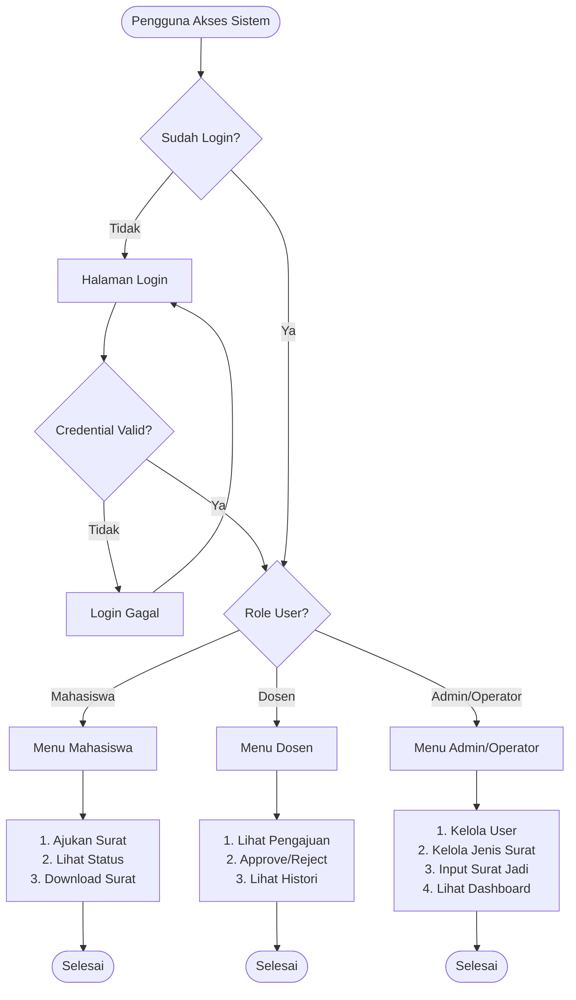
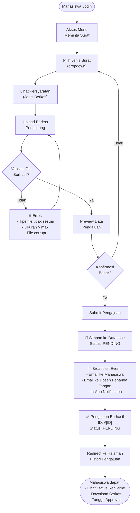
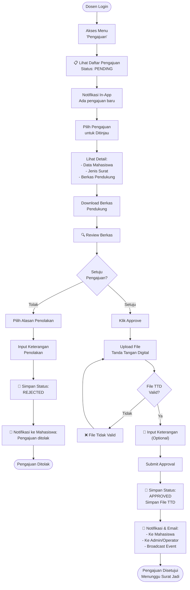
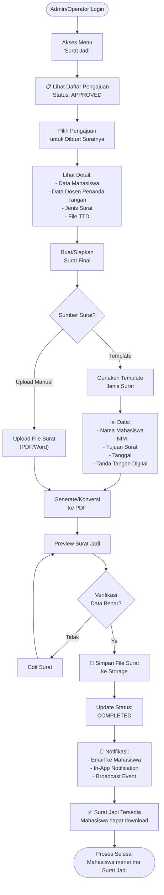
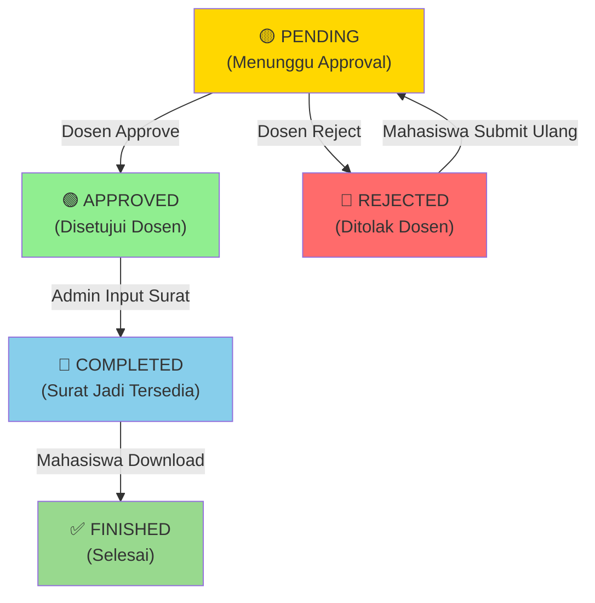
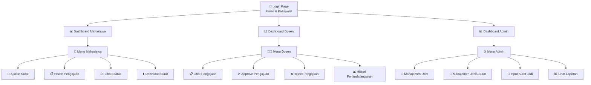
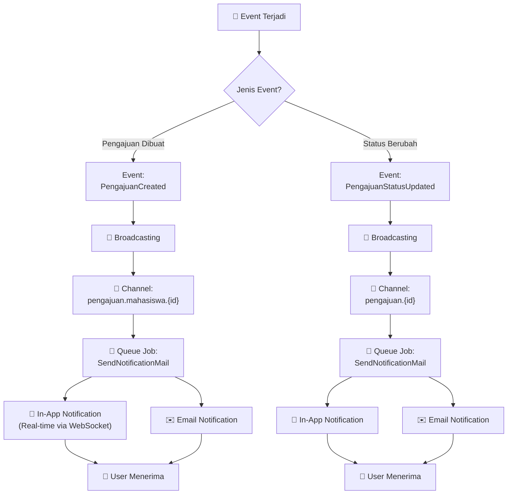
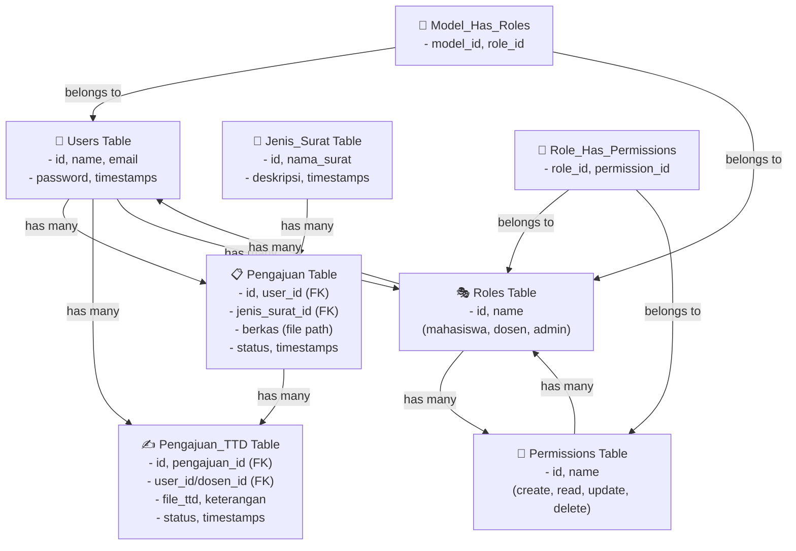
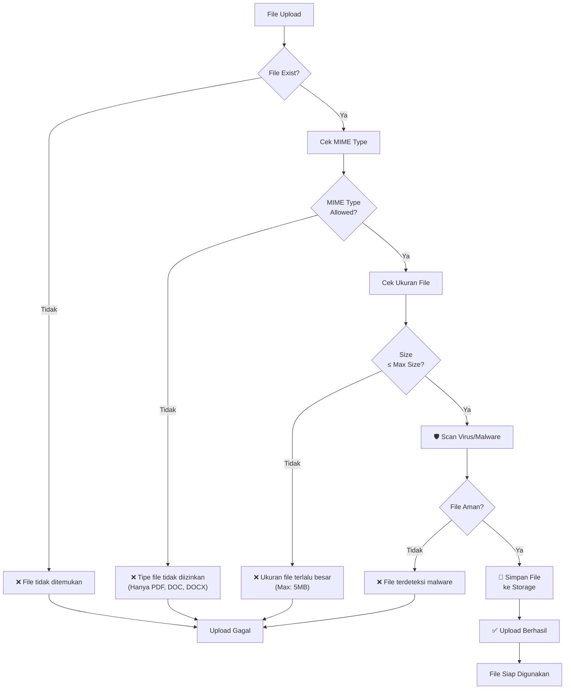
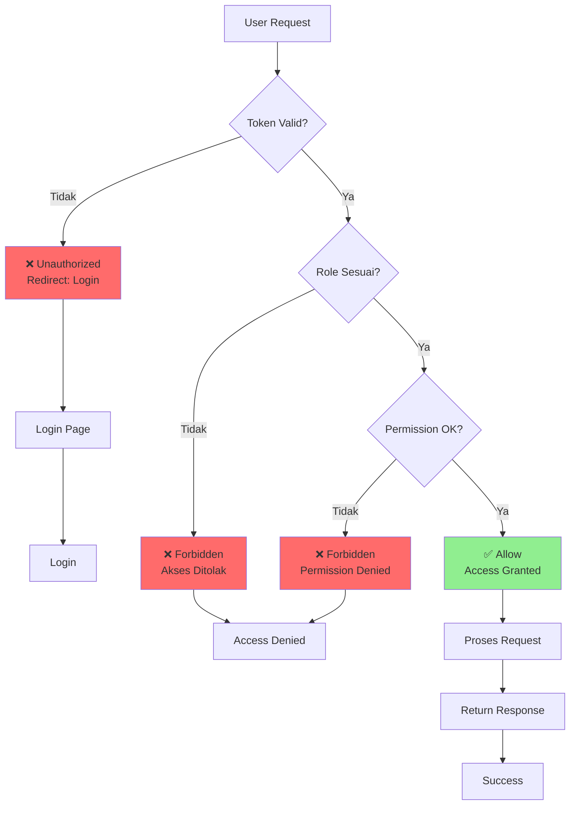

# Flowchart Sistem E-Surat

## 1. Flowchart Umum Sistem

---

## 2. Flowchart Alur Pengajuan Surat (Mahasiswa)

---

## 3. Flowchart Alur Persetujuan Surat (Dosen)

---

## 4. Flowchart Alur Pembuatan Surat Jadi (Admin/Operator)

---

## 5. Flowchart Status Pengajuan

---

## 6. Flowchart Navigasi User

---

## 7. Flowchart Sistem Notifikasi

---

## 8. Flowchart Sistem Database

---

## 9. Flowchart Validasi File Upload

---

## 10. Flowchart Autentikasi & Otorisasi

---

## Deskripsi Singkat Alur Sistem

### 📝 **Fase Pengajuan (Mahasiswa)**

1. Mahasiswa login dan memilih jenis surat
2. Upload berkas pendukung dengan validasi ketat
3. Submit pengajuan yang akan disimpan dengan status **PENDING**
4. Sistem mengirim notifikasi ke dosen dan admin

### ✅ **Fase Persetujuan (Dosen)**

1. Dosen menerima notifikasi pengajuan baru
2. Dosen review berkas dan data mahasiswa
3. Dosen dapat **APPROVE** atau **REJECT**
4. Jika approve, upload file tanda tangan digital
5. Sistem notifikasi otomatis ke mahasiswa dan admin

### 📄 **Fase Pembuatan Surat Jadi (Admin/Operator)**

1. Admin melihat pengajuan yang sudah di-approve
2. Admin membuat/upload surat final
3. Admin verifikasi dan finalisasi surat
4. Status berubah menjadi **COMPLETED**
5. Mahasiswa dapat download surat jadi

### 🔔 **Sistem Notifikasi**

- **Real-time**: WebSocket untuk update in-app
- **Email**: Notifikasi penting dikirim via email
- **Event Broadcasting**: Menggunakan Laravel Event + Queue

### 🔐 **Keamanan**

- RBAC (Role-Based Access Control)
- Permission-based validation
- File upload validation
- CSRF protection
- Password hashing

---

## Status Implementasi

| Fitur             | Status         | Catatan                             |
| ----------------- | -------------- | ----------------------------------- |
| Login/Register    | ✅ Implemented | RBAC, permission-based              |
| Pengajuan Surat   | ✅ Implemented | File upload, real-time notification |
| Persetujuan Dosen | ✅ Implemented | TTD digital, notes                  |
| Surat Jadi        | ✅ Implemented | Upload file, status tracking        |
| Real-time Update  | ✅ Implemented | WebSocket/Reverb                    |
| Email Notifikasi  | ⚠️ Partial     | Queue job ready                     |
| Audit Log         | ❌ Not Yet     | Can be added                        |
| Export Laporan    | ❌ Not Yet     | Can use Excel library               |

---

**Generated**: 2026-06-04 | **Version**: 1.0
