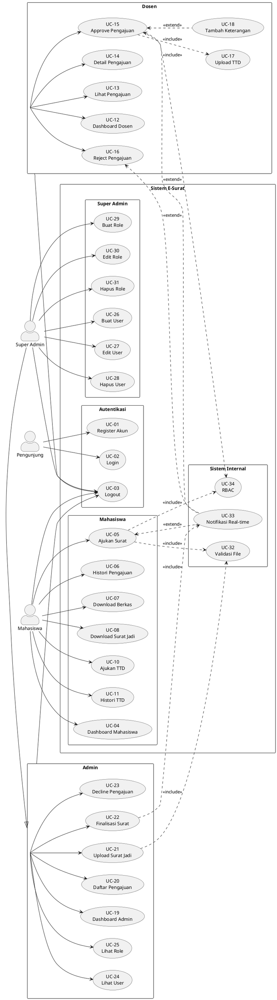
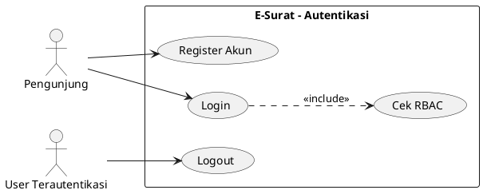
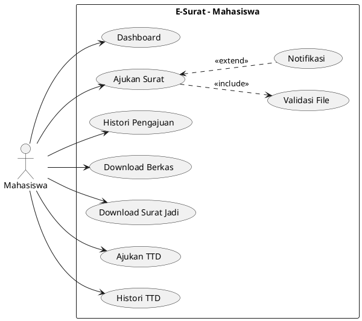
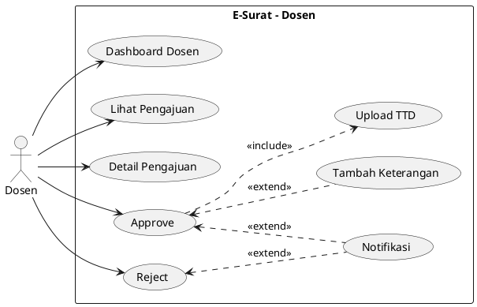
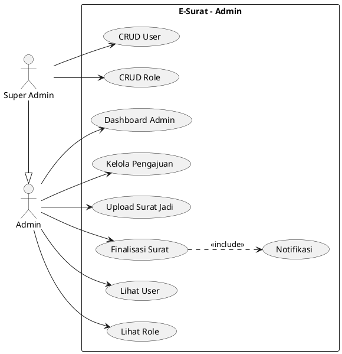

# Use Case Diagram — Sistem E-Surat

Dokumen ini mendeskripsikan use case sistem **E-Surat** (Sistem Manajemen Surat Elektronik) untuk keperluan dokumentasi dan generate diagram gambar via AI.

---

## 1. Ringkasan Sistem

| Item | Keterangan |
|------|------------|
| **Nama Sistem** | E-Surat |
| **Tujuan** | Mengelola pengajuan, persetujuan, dan pembuatan surat secara elektronik di lingkungan akademik |
| **Platform** | Web (Laravel) |
| **Batas Sistem** | Aplikasi web E-Surat (frontend, backend, database, notifikasi real-time) |

---

## 2. Aktor (Actors)

| ID | Aktor | Deskripsi | Ikon (untuk diagram) |
|----|-------|-----------|----------------------|
| A1 | **Pengunjung** | User yang belum login | Stick figure tanpa badge |
| A2 | **Mahasiswa** | Pengaju surat ke universitas | Stick figure + label "Mahasiswa" |
| A3 | **Dosen** | Penandatangan / penyetuju pengajuan | Stick figure + label "Dosen" |
| A4 | **Admin** | Operator yang mengelola pengajuan & surat jadi | Stick figure + label "Admin" |
| A5 | **Super Admin** | Pengelola user, role, dan permission | Stick figure + label "Super Admin" |
| A6 | **Sistem** | Aktor sekunder (notifikasi, validasi, broadcast) | Kotak "Sistem" di luar boundary |

---

## 3. Daftar Use Case

### 3.1 Autentikasi (Aktor: Pengunjung, Semua User)

| ID | Use Case | Aktor | Status |
|----|----------|-------|--------|
| UC-01 | Register Akun | Pengunjung | Implemented |
| UC-02 | Login | Pengunjung | Implemented |
| UC-03 | Logout | Mahasiswa, Dosen, Admin, Super Admin | Implemented |

### 3.2 Mahasiswa

| ID | Use Case | Aktor | Status |
|----|----------|-------|--------|
| UC-04 | Lihat Dashboard Mahasiswa | Mahasiswa | Implemented |
| UC-05 | Ajukan Surat | Mahasiswa | Implemented |
| UC-06 | Lihat Histori Pengajuan | Mahasiswa | Implemented |
| UC-07 | Download Berkas Pendukung | Mahasiswa | Implemented |
| UC-08 | Download Surat Jadi | Mahasiswa | Implemented |
| UC-09 | Lihat Status Pengajuan Real-time | Mahasiswa | Implemented |
| UC-10 | Ajukan Permintaan Tanda Tangan (TTD) | Mahasiswa | Implemented |
| UC-11 | Lihat Histori Pengajuan TTD | Mahasiswa | Implemented |

### 3.3 Dosen

| ID | Use Case | Aktor | Status |
|----|----------|-------|--------|
| UC-12 | Lihat Dashboard Dosen | Dosen | Implemented |
| UC-13 | Lihat Daftar Pengajuan | Dosen | Implemented |
| UC-14 | Lihat Detail Pengajuan | Dosen | Implemented |
| UC-15 | Approve Pengajuan | Dosen | Implemented |
| UC-16 | Reject Pengajuan | Dosen | Partial |
| UC-17 | Upload Tanda Tangan Digital | Dosen | Implemented |
| UC-18 | Tambah Keterangan/Catatan | Dosen | Implemented |

### 3.4 Admin

| ID | Use Case | Aktor | Status |
|----|----------|-------|--------|
| UC-19 | Lihat Dashboard Admin | Admin | Implemented |
| UC-20 | Lihat Daftar Pengajuan | Admin | Implemented |
| UC-21 | Upload Surat Jadi | Admin | Implemented |
| UC-22 | Finalisasi Surat (Status Completed) | Admin | Implemented |
| UC-23 | Tolak/Decline Pengajuan | Admin | Implemented |
| UC-24 | Lihat Daftar User | Admin | Implemented |
| UC-25 | Lihat Daftar Role | Admin | Implemented |

### 3.5 Super Admin

| ID | Use Case | Aktor | Status |
|----|----------|-------|--------|
| UC-26 | Buat User Baru | Super Admin | Implemented |
| UC-27 | Edit User | Super Admin | Implemented |
| UC-28 | Hapus User | Super Admin | Implemented |
| UC-29 | Buat Role Baru | Super Admin | Implemented |
| UC-30 | Edit Role & Permission | Super Admin | Implemented |
| UC-31 | Hapus Role | Super Admin | Implemented |

### 3.6 Sistem (Aktor Sekunder)

| ID | Use Case | Dipicu Oleh | Status |
|----|----------|-------------|--------|
| UC-32 | Validasi Input & File Upload | UC-05, UC-17, UC-21 | Implemented |
| UC-33 | Kirim Notifikasi Real-time | UC-05, UC-15, UC-16, UC-22 | Implemented |
| UC-34 | Cek Role & Permission (RBAC) | Semua use case terproteksi | Implemented |

---

## 4. Relasi Use Case

### 4.1 Include (`<<include>>`)

| Use Case Utama | Include ke |
|----------------|------------|
| UC-05 Ajukan Surat | UC-32 Validasi Input & File Upload |
| UC-05 Ajukan Surat | UC-34 Cek Role & Permission |
| UC-15 Approve Pengajuan | UC-17 Upload Tanda Tangan Digital |
| UC-15 Approve Pengajuan | UC-34 Cek Role & Permission |
| UC-21 Upload Surat Jadi | UC-32 Validasi Input & File Upload |
| UC-22 Finalisasi Surat | UC-33 Kirim Notifikasi Real-time |

### 4.2 Extend (`<<extend>>`)

| Use Case Dasar | Extend oleh | Kondisi |
|----------------|-------------|---------|
| UC-05 Ajukan Surat | UC-33 Kirim Notifikasi Real-time | Setelah pengajuan berhasil disimpan |
| UC-15 Approve Pengajuan | UC-18 Tambah Keterangan/Catatan | Opsional saat approve |
| UC-15 Approve Pengajuan | UC-33 Kirim Notifikasi Real-time | Setelah status berubah approved |
| UC-16 Reject Pengajuan | UC-33 Kirim Notifikasi Real-time | Setelah status berubah rejected |
| UC-22 Finalisasi Surat | UC-08 Download Surat Jadi | Mahasiswa mengunduh setelah completed |

### 4.3 Generalisasi Aktor

```
Super Admin ──generalization──> Admin
Admin       ──generalization──> User Terautentikasi
Dosen       ──generalization──> User Terautentikasi
Mahasiswa   ──generalization──> User Terautentikasi
```

---

## 5. Diagram Use Case (PlantUML)

Salin blok di bawah ke [PlantUML Online](https://www.plantuml.com/plantuml) atau AI image generator yang mendukung PlantUML.



---

## 6. Diagram Use Case per Modul (untuk gambar terpisah)

### 6.1 Modul Autentikasi



### 6.2 Modul Mahasiswa



### 6.3 Modul Dosen



### 6.4 Modul Admin & Super Admin



---

## 7. Spesifikasi Detail Use Case (Utama)

### UC-02 — Login

| Field | Isi |
|-------|-----|
| **Aktor** | Pengunjung |
| **Deskripsi** | User masuk ke sistem menggunakan email dan password |
| **Precondition** | User sudah terdaftar |
| **Postcondition** | User terautentikasi, diarahkan ke dashboard sesuai role |
| **Alur Utama** | 1. User buka halaman login → 2. Input email & password → 3. Sistem validasi credential → 4. Sistem cek role → 5. Redirect ke dashboard |
| **Alur Alternatif** | 3a. Credential salah → tampilkan pesan error, kembali ke form login |

---

### UC-05 — Ajukan Surat

| Field | Isi |
|-------|-----|
| **Aktor** | Mahasiswa |
| **Deskripsi** | Mahasiswa mengajukan permintaan surat ke universitas |
| **Precondition** | Mahasiswa sudah login, memiliki permission `create.pengajuan` |
| **Postcondition** | Pengajuan tersimpan dengan status **PENDING** |
| **Alur Utama** | 1. Akses menu "Meminta Surat" → 2. Pilih jenis surat → 3. Upload berkas pendukung → 4. Submit → 5. Sistem validasi file → 6. Simpan ke database → 7. Broadcast notifikasi → 8. Redirect ke histori |
| **Alur Alternatif** | 5a. File tidak valid (tipe/ukuran) → tampilkan error, kembali ke form upload |

---

### UC-15 — Approve Pengajuan

| Field | Isi |
|-------|-----|
| **Aktor** | Dosen |
| **Deskripsi** | Dosen menyetujui pengajuan surat mahasiswa |
| **Precondition** | Pengajuan berstatus **PENDING**, dosen sudah login |
| **Postcondition** | Status pengajuan berubah menjadi **APPROVED**, file TTD tersimpan |
| **Alur Utama** | 1. Buka daftar pengajuan → 2. Pilih pengajuan → 3. Review detail & berkas → 4. Klik Approve → 5. Upload file TTD → 6. (Opsional) Tambah keterangan → 7. Submit → 8. Sistem update status → 9. Notifikasi ke mahasiswa & admin |
| **Alur Alternatif** | 5a. File TTD tidak valid → tampilkan error |

---

### UC-16 — Reject Pengajuan

| Field | Isi |
|-------|-----|
| **Aktor** | Dosen |
| **Deskripsi** | Dosen menolak pengajuan surat dengan alasan |
| **Precondition** | Pengajuan berstatus **PENDING** |
| **Postcondition** | Status pengajuan berubah menjadi **REJECTED** |
| **Alur Utama** | 1. Buka detail pengajuan → 2. Klik Reject → 3. Input alasan penolakan → 4. Submit → 5. Sistem update status → 6. Notifikasi ke mahasiswa |

---

### UC-21 — Upload Surat Jadi

| Field | Isi |
|-------|-----|
| **Aktor** | Admin |
| **Deskripsi** | Admin mengunggah file surat final untuk pengajuan yang sudah disetujui dosen |
| **Precondition** | Pengajuan berstatus **APPROVED** |
| **Postcondition** | File surat jadi tersimpan di storage |
| **Alur Utama** | 1. Buka daftar pengajuan approved → 2. Pilih pengajuan → 3. Lihat detail (mahasiswa, dosen, TTD) → 4. Upload file surat (PDF/DOC) → 5. Sistem validasi file → 6. Simpan file |

---

### UC-22 — Finalisasi Surat

| Field | Isi |
|-------|-----|
| **Aktor** | Admin |
| **Deskripsi** | Admin menandai pengajuan sebagai selesai setelah surat jadi diupload |
| **Precondition** | File surat jadi sudah diupload |
| **Postcondition** | Status pengajuan menjadi **COMPLETED**, mahasiswa dapat download |
| **Alur Utama** | 1. Verifikasi surat jadi → 2. Submit finalisasi → 3. Update status COMPLETED → 4. Kirim notifikasi real-time ke mahasiswa |

---

## 8. Alur Status Pengajuan (Konteks Use Case)

```
[PENDING] ──(UC-15 Approve)──> [APPROVED] ──(UC-21 + UC-22)──> [COMPLETED] ──(UC-08)──> Download
     │
     └──(UC-16 Reject)──> [REJECTED]
```

---

## 9. Prompt untuk AI Image Generator

Gunakan prompt di bawah untuk generate **diagram use case UML** sebagai gambar. Sesuaikan dengan tool yang Anda pakai (DALL-E, Midjourney, Gemini, dll).

### 9.1 Prompt — Diagram Use Case Lengkap (English)

```
Create a clean UML use case diagram for an academic letter management system called "E-Surat".

Style: professional software documentation, white background, black lines, standard UML notation, vector-like, high contrast, readable text labels.

System boundary: large rectangle labeled "Sistem E-Surat".

Actors outside the boundary (stick figures):
- Pengunjung (Visitor)
- Mahasiswa (Student)
- Dosen (Lecturer)
- Admin
- Super Admin (generalization arrow to Admin)

Use cases inside grouped packages:
Autentikasi: Register Akun, Login, Logout
Mahasiswa: Dashboard, Ajukan Surat, Histori Pengajuan, Download Berkas, Download Surat Jadi, Ajukan TTD
Dosen: Dashboard Dosen, Lihat Pengajuan, Approve Pengajuan, Reject Pengajuan, Upload TTD
Admin: Dashboard Admin, Upload Surat Jadi, Finalisasi Surat, Lihat User, Lihat Role
Super Admin: CRUD User, CRUD Role

Show association lines from actors to use cases.
Show <<include>> dashed arrows: Ajukan Surat includes Validasi File; Approve includes Upload TTD.
Show <<extend>> dashed arrows: Notifikasi Real-time extends Ajukan Surat and Approve.

No decorative elements. Technical diagram only. Landscape orientation A4.
```

### 9.2 Prompt — Diagram Use Case Lengkap (Bahasa Indonesia)

```
Buat diagram use case UML untuk sistem "E-Surat" (Sistem Manajemen Surat Elektronik akademik).

Gaya: dokumentasi perangkat lunak profesional, latar putih, garis hitam, notasi UML standar, teks terbaca jelas, seperti diagram di buku rekayasa perangkat lunak.

Kotak sistem: "Sistem E-Surat"

Aktor (stick figure di luar kotak):
- Pengunjung, Mahasiswa, Dosen, Admin, Super Admin

Use case di dalam kotak dikelompokkan:
- Autentikasi: Register, Login, Logout
- Mahasiswa: Ajukan Surat, Histori Pengajuan, Download Surat Jadi
- Dosen: Lihat Pengajuan, Approve, Reject, Upload TTD
- Admin: Upload Surat Jadi, Finalisasi Surat
- Super Admin: Kelola User, Kelola Role

Hubungkan aktor ke use case dengan garis asosiasi.
Tambahkan relasi <<include>> dan <<extend>> dengan garis putus-putus.
Orientasi landscape, tanpa dekorasi, fokus diagram teknis.
```

### 9.3 Prompt — Diagram per Modul (Mahasiswa saja)

```
UML use case diagram, module "Mahasiswa" only, system "E-Surat".

Actor: Mahasiswa (stick figure on the left).

Use cases inside system boundary:
- Dashboard Mahasiswa
- Ajukan Surat
- Histori Pengajuan
- Download Berkas Pendukung
- Download Surat Jadi
- Ajukan Permintaan TTD
- Histori Pengajuan TTD

Include relationship: Ajukan Surat <<include>> Validasi File Upload.
Extend relationship: Notifikasi Real-time <<extend>> Ajukan Surat.

Clean white background, black UML lines, software engineering textbook style, portrait orientation.
```

### 9.4 Prompt — Diagram per Modul (Dosen saja)

```
UML use case diagram for lecturer module in "E-Surat" academic letter system.

Actor: Dosen (Lecturer stick figure).

Use cases:
- Dashboard Dosen
- Lihat Daftar Pengajuan
- Lihat Detail Pengajuan
- Approve Pengajuan
- Reject Pengajuan
- Upload Tanda Tangan Digital
- Tambah Keterangan

Relationships:
Approve <<include>> Upload TTD
Tambah Keterangan <<extend>> Approve
Notifikasi <<extend>> Approve and Reject

Professional UML diagram, white background, readable labels in Indonesian.
```

### 9.5 Prompt — Diagram per Modul (Admin saja)

```
UML use case diagram for admin module in "E-Surat" system.

Actors: Admin and Super Admin (Super Admin inherits from Admin with generalization arrow).

Admin use cases: Dashboard, Lihat Pengajuan, Upload Surat Jadi, Finalisasi Surat, Lihat User, Lihat Role.

Super Admin use cases: Buat User, Edit User, Hapus User, Buat Role, Edit Role, Hapus Role.

Finalisasi Surat <<include>> Kirim Notifikasi Real-time.

Clean technical diagram, landscape, Indonesian labels.
```

### 9.6 Prompt — Diagram Alur Status (Activity-style, pelengkap)

```
Create a simple flowchart diagram showing letter request status flow for "E-Surat" system.

Nodes:
- PENDING (yellow) - waiting lecturer approval
- APPROVED (green) - approved by lecturer
- REJECTED (red) - rejected by lecturer
- COMPLETED (blue) - final letter ready

Arrows:
PENDING -> APPROVED (label: Dosen Approve)
PENDING -> REJECTED (label: Dosen Reject)
APPROVED -> COMPLETED (label: Admin Upload & Finalisasi)
COMPLETED -> Download (label: Mahasiswa Download)

White background, rounded rectangles, clear arrows, software documentation style.
```

---

## 10. Matriks Aktor × Use Case

| Use Case | Pengunjung | Mahasiswa | Dosen | Admin | Super Admin |
|----------|:----------:|:---------:|:-----:|:-----:|:-----------:|
| Register | ✅ | | | | |
| Login | ✅ | | | | |
| Logout | | ✅ | ✅ | ✅ | ✅ |
| Dashboard Mahasiswa | | ✅ | | | |
| Ajukan Surat | | ✅ | | | |
| Histori Pengajuan | | ✅ | | | |
| Download Berkas/Surat | | ✅ | | | |
| Ajukan & Histori TTD | | ✅ | | | |
| Dashboard Dosen | | | ✅ | | |
| Lihat/Approve/Reject Pengajuan | | | ✅ | | |
| Upload TTD | | | ✅ | | |
| Dashboard Admin | | | | ✅ | ✅ |
| Kelola Pengajuan & Surat Jadi | | | | ✅ | ✅ |
| Lihat User & Role | | | | ✅ | ✅ |
| CRUD User | | | | | ✅ |
| CRUD Role | | | | | ✅ |

---

## 11. Catatan untuk Generate Gambar

1. **PlantUML** (disarankan): Salin kode di Bagian 5 atau 6 ke [plantuml.com](https://www.plantuml.com/plantuml) — hasilnya diagram vektor akurat, bukan AI interpretasi.
2. **AI Image Generator**: Gunakan prompt Bagian 9. Hasil mungkin kurang presisi untuk notasi UML; perlu iterasi atau edit manual.
3. **Kombinasi terbaik**: Generate diagram utama via PlantUML, gunakan AI hanya untuk ilustrasi cover atau diagram alur status (Bagian 9.6).
4. **Bahasa label**: Prompt bilingual disediakan; pilih satu bahasa konsisten per diagram.

---

**Dokumen:** USE_CASE_DIAGRAM.md  
**Versi:** 1.0  
**Tanggal:** 2026-06-08  
**Berdasarkan:** ANALISIS_KEBUTUHAN_FUNCTIONAL.md, FLOWCHART_SISTEM.md, routes/web.php
